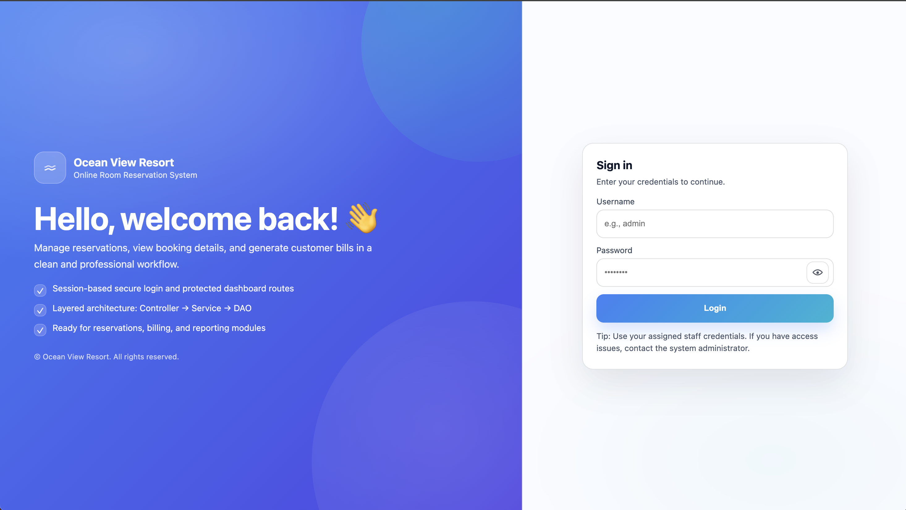
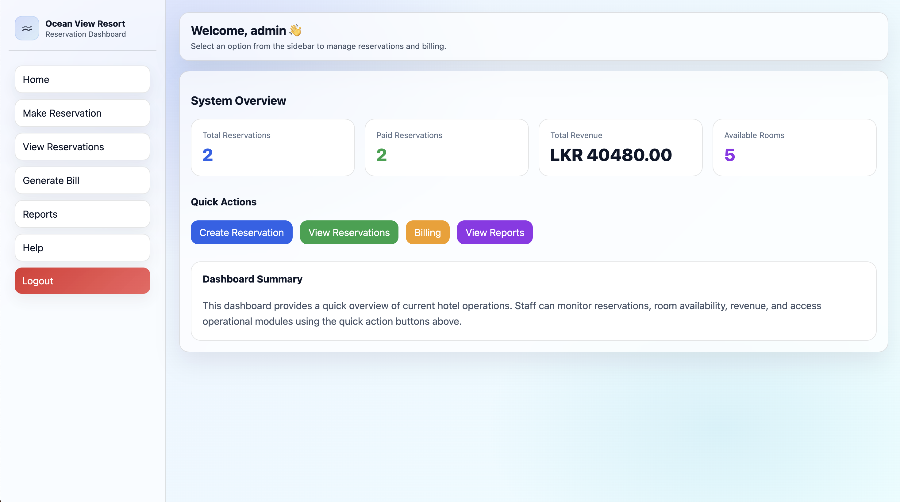
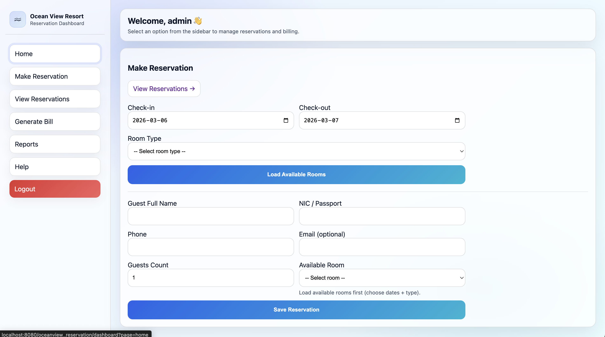
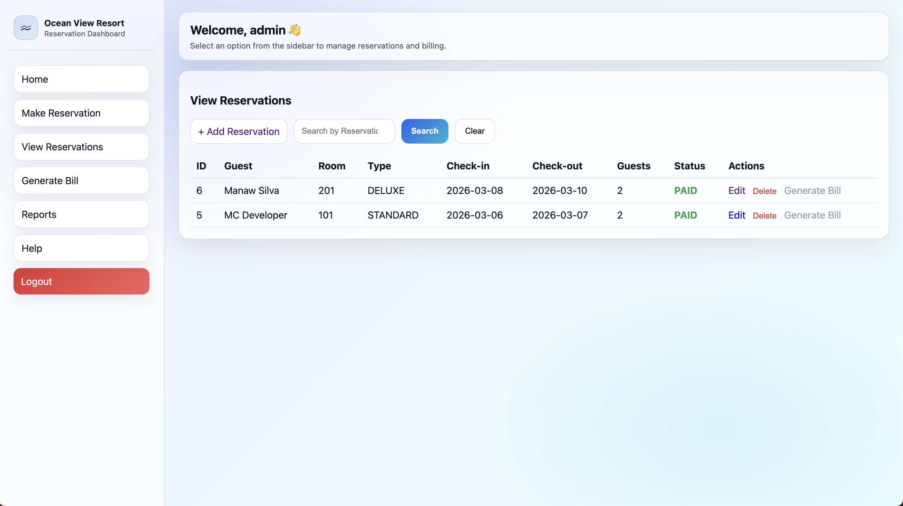
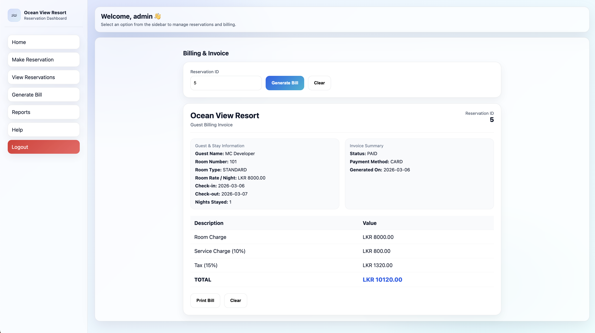
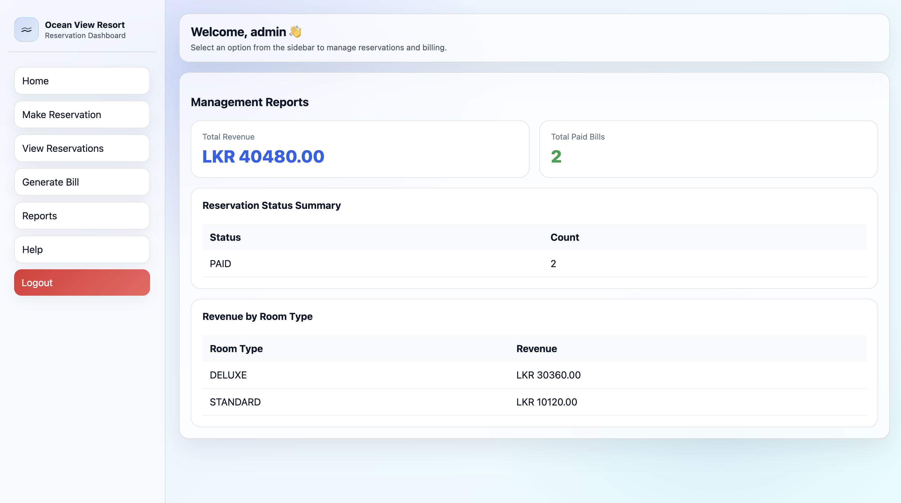

# 🌊 Ocean View Resort – Reservation Management System

<p align="center">
A modern web-based hotel reservation system built using Java EE (Servlets & JSP).
</p>

<p align="center">


</p>

---

# 📌 Overview

Ocean View Resort is a **hotel reservation management system** that allows staff to manage reservations, generate invoices, process payments, and view operational reports through a centralized dashboard.

The system follows **enterprise software architecture practices** including layered architecture, design patterns, and REST-style web services.

---

# 🧱 System Architecture

```
Presentation Layer   → JSP User Interfaces
Controller Layer     → Servlets
Service Layer        → Business Logic
DAO Layer            → Database Access
Database Layer       → MySQL
```

This **3-tier architecture** improves maintainability, scalability, and separation of concerns.

---

# ⚙ Technology Stack

| Layer           | Technology                 |
|-----------------|----------------------------|
| Backend         | Java EE (Jakarta Servlets) |
| Frontend        | JSP / HTML / CSS           |
| Database        | MySQL                      |
| Server          | Apache Tomcat              |
| IDE             | IntelliJ IDEA              |
| Version Control | Git & GitHub               |

---

# 🚀 Core Features

| Module            | Description                                          |
|-------------------|------------------------------------------------------|
| 🔐 Authentication | Secure login with session management                 |
| 📊 Dashboard      | System overview with operational statistics          |
| 🛎 Reservations   | Create, edit, delete, and search reservations        |
| 💳 Billing        | Invoice generation with tax and service calculations |
| 📈 Reports        | Revenue and reservation analytics                    |
| 🌐 APIs           | JSON endpoints for distributed system integration    |
| 📖 Help           | Staff guide for system usage                         |

---

# 🌐 Web Service APIs

The system exposes REST-style endpoints returning JSON.

```
/api/reservations
/api/bills
/api/reports/revenue
```

These APIs allow integration with external applications.

---

# 🧩 Design Patterns

| Pattern          | Implementation                            |
|------------------|-------------------------------------------|
| Singleton        | DBConnection for database access          |
| MVC              | JSP (View) + Servlet (Controller) + Model |
| DAO              | ReservationDAO, BillingDAO, ReportsDAO    |
| Front Controller | DashboardServlet request routing          |

---

# 🗄 Database Structure

Main tables used in the system:

```
users
guests
room_types
rooms
reservations
bills
```

Relationships:

```
Room Types → Rooms
Rooms → Reservations
Reservations → Bills
```

---

# 📷 System Preview

### Login Page


### Dashboard


### Reservation Add Module


### Reservation View Module


### Billing Invoice


### Reports


---

# ⚡ Installation

### Requirements

- Java JDK 17+
- Apache Tomcat
- MySQL
- IntelliJ IDEA

### Setup

1️⃣ Clone repository

```
git clone <repo-url>
```

2️⃣ Import project into **IntelliJ**

3️⃣ Configure database connection in

```
DBConnection.java
```

4️⃣ Deploy to **Apache Tomcat**

5️⃣ Open in browser

```
http://localhost:8080/oceanview_reservation/login
```

---

# 🔑 Default Login

```
Username: admin
Password: admin123
```

---

# 🔀 Git Workflow

```
feature branches
      ↓
development
      ↓
QA
      ↓
master
      ↓
v1.0.0 release
```

All features were implemented using **feature branches and pull requests**.

---

# 📦 Version

```
v1.0.0 – Initial Stable Release
```

Includes authentication, reservation management, billing, reports, APIs, and dashboard.

---

# 👨‍💻 Author 

Msc-Repo

Developed for **CIS6003 Advanced Programming Module**

Ocean View Resort Reservation System